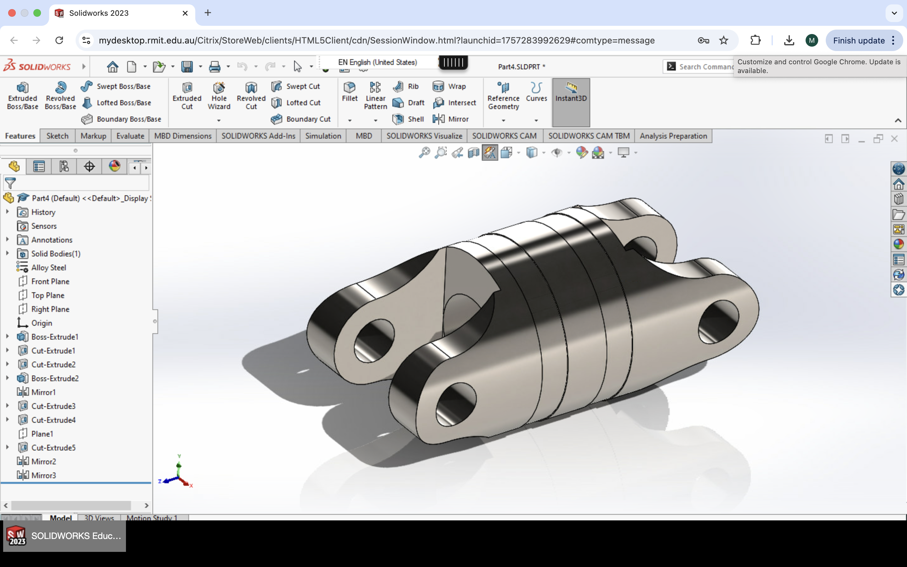
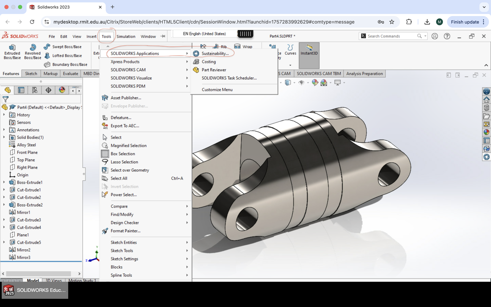
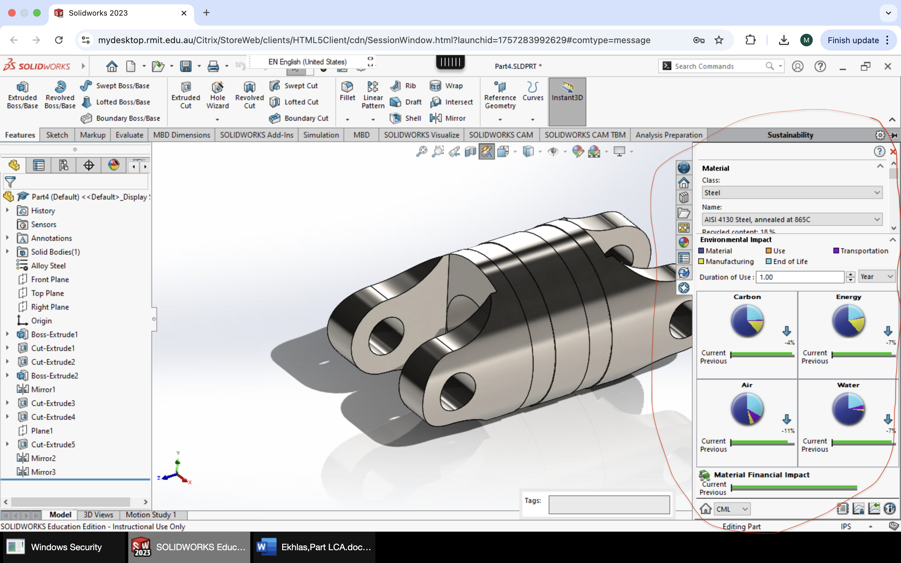

# Life Cycle Assessment (LCA) using SolidWorks

This project demonstrates a **Life Cycle Assessment (LCA)** conducted using the **SolidWorks Sustainability** tool.

## Project Overview
The study evaluates the environmental impact of a mechanical component across its full lifecycle, including:
- Material selection  
- Manufacturing process  
- Product use  
- End-of-life stage  

## Analysis Scope
The assessment focuses on:
- Carbon footprint  
- Energy consumption  
- Air emissions  
- Water usage  

The results support sustainable mechanical design decisions by comparing environmental impacts at different lifecycle stages.

## Tools Used
- SolidWorks  
- SolidWorks Sustainability Tool  

## Project Type
Academic project – Mechanical Engineering / Sustainable Design

## Project Images

.jpg)

